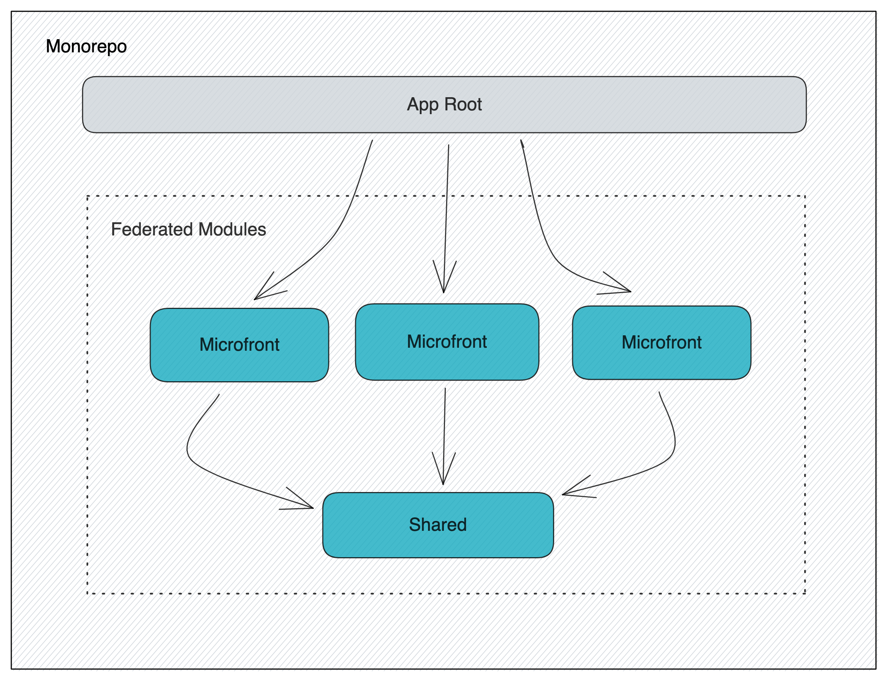

> ## My Store Micro Frontends

Micro frontends playground with module federation ⚡



> ### Getting Started

```sh
# install dependencies
$ yarn install

# run the project
$ yarn start
```

> ### Commands

- `start`: runs server on `localhost:3000`
- `start:live`: runs dev server with live reload on `localhost:3000`

> ### Built with

- Webpack
- React
- React Router DOM
- Styled Components
- Polished
- Redux Toolkit
